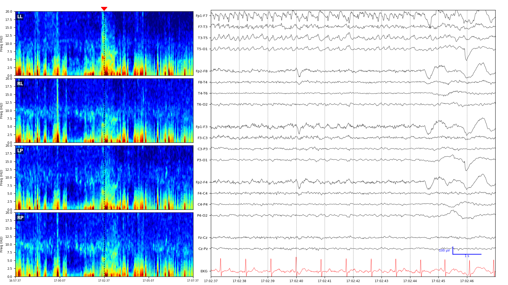

# IIIC Crowdsourcing — code & data for Kong et al. 2025

This repository contains the analysis code that reproduces every figure,
table, and supplemental analysis in:

> **Kong W-Y**, Nascimento FA, Struck A, Duhaime E, Kapur S, Amorim E,
> Kapinos G, Rodriguez A, Thomas B, Desai M, Lee JW, Westover MB, Jing J.
> *Evaluating crowdsourcing for ICU EEG annotation: A comparison with
> expert performance.* **Epilepsia** 2025;66(11):4366-4380.
> [doi:10.1111/epi.18547](https://doi.org/10.1111/epi.18547)

The data live on BDSP at
**https://bdsp.io/projects/87rztvzmyz9uh0esnd83/** — download `test_df4.csv`
(plus `labels_experts30.xlsx` for Supplemental S4-S5 and the demographics
CSVs for Supplemental S1) into [`data/`](data/) and you can rerun every
analysis below.

## Repository layout

```
iiic-crowdsourcing/
├── src/                  importable Python package
│   ├── config.py         paths and SRPP/group constants
│   ├── data_loading.py   readers for the three input files
│   ├── scoring.py        per-problem aggregation + weighted-majority voting
│   ├── mixed_models.py   the 4 mixed-effects models + non-inferiority tests
│   ├── irr.py            pairwise agreement, Fleiss kappa, Gwet AC1
│   ├── bootstrap.py      Figure 5 sample-size sweep
│   └── plotting.py       shared matplotlib helpers
├── scripts/              one script per figure / table
│   ├── reproduce_all.py  driver — runs every script below
│   ├── table1_participants.py
│   ├── figure2_predicted_accuracy.py
│   ├── figure3_forest_plot.py
│   ├── figure4_individual_experts.py
│   ├── figure5_bootstrap_samplesize.py
│   └── supp_s1..s11*.py
├── data/                 input files live here (gitignored, see data/README.md)
├── figures/              outputs land here (gitignored)
├── notebooks_original/   Wan-Yee's original notebooks, scrubbed of secrets
├── docs/                 working notes (Wan-Yee email, etc.)
└── LICENSE               CC BY-NC 4.0 (non-commercial, academic use)
```

## What each figure depends on

| Item | Script | Inputs |
|---|---|---|
| **Table 1** | `scripts/table1_participants.py` | `test_df4.csv` |
| **Figure 2** | `scripts/figure2_predicted_accuracy.py` | `test_df4.csv` |
| **Figure 3** | `scripts/figure3_forest_plot.py` | `test_df4.csv` |
| **Figure 4** | `scripts/figure4_individual_experts.py` | `test_df4.csv` |
| **Figure 5** | `scripts/figure5_bootstrap_samplesize.py` | `test_df4.csv` (slow — ~1000 bootstraps) |
| **Supp S1** | `scripts/supp_s1_countries.py` | `test_df4.csv` + (`1251-all-users_demo_info.csv` or `eeg-all-users-and-topics.csv`) |
| **Supp S2** | `scripts/supp_s2_accuracy_vs_questions.py` | `test_df4.csv` |
| **Supp S3** | `scripts/supp_s3_time_in_practice.py` | none (paper-derived table) |
| **Supp S4** | `scripts/supp_s4_irr_study_experts.py` | `test_df4.csv` |
| **Supp S5** | `scripts/supp_s5_violin_studyvsgold.py` | `test_df4.csv` + `labels_experts30.xlsx` |
| **Supp S6** | `scripts/supp_s6_individual_expert_by_srpp.py` | `test_df4.csv` |
| **Supp S7+S8** | `scripts/supp_s7_s8_leave_one_group_out.py` | `test_df4.csv` |
| **Supp S9** | `scripts/supp_s9_hardfilter.py` | `test_df4.csv` |
| **Supp S10** | `scripts/supp_s10_subgroup_forest.py` | `test_df4.csv` |
| **Supp S11** | `scripts/supp_s11_accuracy_histograms.py` | `test_df4.csv` |

`test_df4.csv` is the master per-response dataframe. The full schema and the
upstream pipeline that produced it are documented in
[`data/README.md`](data/README.md).

## Quick start

```bash
# 1. Clone and create a virtual environment.
git clone https://github.com/bdsp-core/iiic-crowdsourcing-wanyee.git
cd iiic-crowdsourcing-wanyee
python -m venv .venv && source .venv/bin/activate
pip install -r requirements.txt

# 2. Download the data files (see data/README.md) into ./data/.

# 3. Reproduce everything.
python scripts/reproduce_all.py

# Or run individual analyses:
python scripts/figure3_forest_plot.py
python scripts/supp_s4_irr_study_experts.py
```

Outputs land in `figures/` as PNG + PDF, accompanied by a `*.csv` of the
numeric values backing each plot for spot-checking.

## Regenerating the contest images

Figure 1 of the paper shows the standardised question format every contest
participant saw: a 10 s EEG epoch in longitudinal-bipolar montage paired
with four 10-minute regional-average spectrograms (LL, RL, LP, RP). Each
image was rendered from one of Jin Jing's per-segment `.mat` files.

The original MATLAB renderer (`scripts/contest_image_gen/main_getImage.m`)
is preserved for reference. A Python port that produces equivalent images
without requiring a MATLAB license lives at
`scripts/contest_image_gen/make_contest_image.py`:

```bash
# From a single .mat file
python scripts/contest_image_gen/make_contest_image.py \
  --segment-id pat0002_20161004_141027_5167 \
  --mat-dir /path/to/ImageCode_JJ/Data \
  --out figures/contest_image_pat0002.png

# Or directly from the bundled HDF5
python scripts/contest_image_gen/make_contest_image.py \
  --segment-id pat0002_20161004_141027_5167 \
  --h5 data/iiic_contest_eeg.h5 \
  --out figures/contest_image_pat0002.png
```

Sample output (segment `pat0002_20161004_141027_5167`):



The Python port applies the same 0.5–40 Hz bandpass + 60 Hz notch as the
MATLAB code, builds the 18-derivation longitudinal-bipolar montage in the
identical channel order, and uses the same `jet` colormap with
`vmin=-10 dB`, `vmax=25 dB` color limits for the spectrograms.

## Bundling the EEG signals into HDF5

The raw EEG signals + 10-minute spectrograms are stored as one .mat file per
EEG segment (~2 MB each × ~10,704 segments ≈ 20 GB). For distribution we
bundle them into a single compressed HDF5 archive,
`iiic_contest_eeg.h5` (~12 GB), with random access by segment id:

```bash
python scripts/bundle_eeg_h5.py \
  --mat-dir /path/to/ImageCode_JJ/Data \
  --out data/iiic_contest_eeg.h5 \
  --annotations data/test_df4.csv \
  --experts30 data/labels_experts30.xlsx
```

The resulting file has this layout:

```
iiic_contest_eeg.h5
├── /segments/<segment_id>/
│   ├── data_50sec        (21, 10000) float32   ← downcast from float64; max abs error ~1e-4
│   ├── spec_LL           (100, 300)  float32
│   ├── spec_RL           (100, 300)  float32
│   ├── spec_LP           (100, 300)  float32
│   └── spec_RP           (100, 300)  float32
│   attrs: gold_standard_label, contest_image_url, patient_id,
│          gold_votes_{other, seizure, lpd, gpd, lrda, grda}
├── /index/segment_ids    (N,) str
├── /index/expert_ids     (30,) str
└── attrs: sampling_rate_hz=200, channel_names_21, srpp_labels, description
```

Round-trip is verified against the source .mat files (max abs error
~1e-8 relative). To pull a single segment as a numpy array:

```python
import h5py
with h5py.File("data/iiic_contest_eeg.h5") as h:
    eeg = h["segments/abn10329_20120330_100857_1957/data_50sec"][:]
    label = h["segments/abn10329_20120330_100857_1957"].attrs["gold_standard_label"]
```

## Reproducing the upstream pipeline (optional)

If you want to rebuild `test_df4.csv` from the raw Centaur Labs exports
(per-question summary + per-read responses) and the 30-expert vote MATs,
see the documented pipeline in [`data/README.md`](data/README.md). The
original notebook that implements that pipeline,
`csvforeachexpertlevelandcompletewithgoldstandard.ipynb`, is preserved
verbatim under `notebooks_original/`.

## Citing

If you use this code or data, please cite:

```
Kong W-Y, Nascimento FA, Struck A, Duhaime E, Kapur S, Amorim E, Kapinos G,
Rodriguez A, Thomas B, Desai M, Lee JW, Westover MB, Jing J.
Evaluating crowdsourcing for ICU EEG annotation: A comparison with expert
performance. Epilepsia. 2025;66(11):4366-4380.
https://doi.org/10.1111/epi.18547
```

## License

Code and data are released under
**[Creative Commons Attribution-NonCommercial 4.0 International (CC BY-NC 4.0)](LICENSE)**.
You're welcome to use, modify, and redistribute everything here for
academic and non-commercial research; for any commercial use please contact
the corresponding author.
